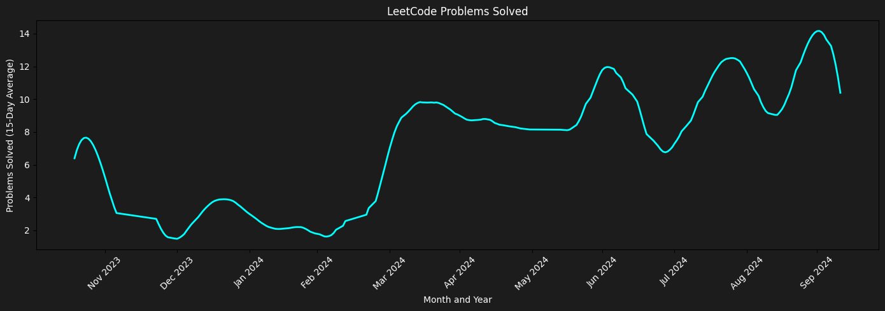

# Hi I am _Aneesh_ ! 👋

I'm passionate about coding and building exciting projects. Here's a glimpse of what you'll find in my repositories:

- 🌐 **Web Development Projects**: I love working with web technologies, and my projects span a wide range. You'll find projects using frameworks like **Django**, **React**, **Next.JS**,and even some **Sveltekit** applications.

- 🤖 **Machine Learning Adventures**: I've also delved into the world of **Machine Learning**, with projects covering everything from data collection to making predictions using a diverse set of ML algorithms. 

If you're as enthusiastic about coding as I am, dive into my repositories to explore my coding journey and contributions. Thanks for visiting my GitHub profile.

## Technologies and Tools

### Languages

### Frontend

### Backend

### Cloud Platforms

### Database

### UI Design

## Stats

<table>
  <tr>
    <td width="60%">
      
    </td>
    <td width="40%">
      
    </td>
  </tr>
  <tr>
      <td colspan="2">
      
    </td>
  </tr>
</table>

## Know more about me
- 
- 
